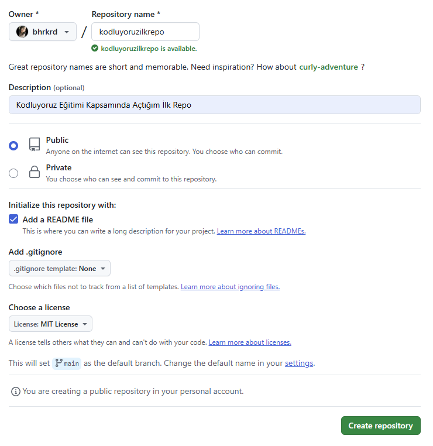

# Kodluyoruz İlk Repo 
Bu repo [Kodluyoruz](kodluyororuz.org) Front-End eğitiminde oluşturduğumuz ilk repo. İçerisinde bir adet README dosyası, bir adet de index.html barındırıyor.



## Installation
Öncelikle projeyi clonelayın. (Buraya sizin reponuzdan aldığınız link gelecek.)
```bash
git clone https://github.com/baharkaraduman/kodluyoruzilkrepo.git
```

## Usage
Projeyi cloneladıktan sonra Visual Studio Code programında açınız.

Linux için:
```linux
cd.kodluyoruzilkrepo
code.
```

## Contributing
Pull requstler kabul edilir. Büyük değişiklikler içini, lütfen önce neyi değiştirmek istediğinizi tartışmak için bir konu açın

## LICENSE
[MIT](https://choosealicense.com/licenses/mit/)